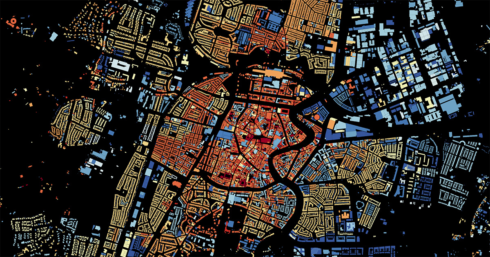

# All 11.333.878 buildings in the Netherlands

[](https://bertspaan.nl/buildings)

https://bertspaan.nl/buildings

This map shows all buildings in the Netherlands, colored by their year of construction. This map is made by [Bert Spaan](https://bertspaan.nl) — it's an improved and updated version of [the map I made in 2013](https://code.waag.org/buildings). The data comes from the [BAG](https://www.kadaster.nl/zakelijk/registraties/basisregistraties/bag/over-bag), the Dutch building and addresses registry.

The Netherlands looked different in 2015, when the first version of this map was last updated. According to the data, 1.467.339 new buildings have been built since then.

## Legend

The map uses these year classes:

| Class       | Color       | Hex       | Rationale                                         |
| ----------- | ----------- | --------- | ------------------------------------------------- |
| `< 1700`    | dark red    | `#a50026` | Very old buildings, visually distinct             |
| `1700-1849` | red         | `#d73027` | 18th century and early 19th-century buildings     |
| `1850-1900` | orange-red  | `#f46d43` | Industrial urban growth before the Woningwet      |
| `1901-1918` | orange      | `#fdae61` | Early Woningwet era                               |
| `1919-1945` | pale orange | `#fee090` | Interwar period plus the war years                |
| `1946-1965` | yellow      | `#ffffbf` | Reconstruction / wederopbouw                      |
| `1966-1973` | pale blue   | `#e0f3f8` | Growth-dispersion / Tweede Nota period            |
| `1974-1991` | light blue  | `#abd9e9` | Late postwar expansion, urban renewal, pre-VINEX  |
| `1992-2004` | blue        | `#74add1` | VINEX and early 1990s/2000s housing policy era    |
| `2005-2014` | blue        | `#4a7fbe` | Late VINEX, crisis years, and post-crisis restart |
| `>= 2015`   | dark blue   | `#3a5fa8` | Contemporary buildings                            |

## Research Links

- CBS housing stock timeline: https://www.cbs.nl/nl-nl/longread/diversen/2025/tijdlijn-woningvoorraad
- CBS on the first Woningwet: https://www.cbs.nl/nl-nl/longread/diversen/2025/tijdlijn-woningvoorraad/1899-verbetering-huisvesting-met-eerste-woningwet
- CBS on postwar reconstruction: https://www.cbs.nl/nl-nl/longread/diversen/2025/tijdlijn-woningvoorraad/1946-woningnood-en-wederopbouw
- CBS on 1966 and movement out of the biggest cities: https://www.cbs.nl/nl-nl/longread/diversen/2025/tijdlijn-woningvoorraad/1966-uittocht-uit-de-grootste-steden
- CBS on VINEX: https://www.cbs.nl/nl-nl/longread/diversen/2025/tijdlijn-woningvoorraad/1990-vinex-wijken
- Rijksdienst voor het Cultureel Erfgoed on the reconstruction period (`1940-1965`): https://www.cultureelerfgoed.nl/onderwerpen/w/wederopbouw
- Parlement.com on the 1901 Woningwet: https://www.parlement.com/kabinet-pierson-1897-1901

## Running and building locally.

First, download the BAG GeoPackage file (`bag-light.gpkg`) and place it in the `./data` directory: https://www.kadaster.nl/zakelijk/producten/adressen-en-gebouwen/bag-geopackage.

Then, create all files needed for the map. Run the following command in the root of the project:

```bash
pnpm build-address-lookup
pnpm cluster-new-building-clusters
pnpm export-new-building-cluster-overlay
pnpm count-buildings
pnpm export-raster
pnpm export-vector
```

Now you can run the map locally:

```bash
pnpm install
pnpm run dev
```
