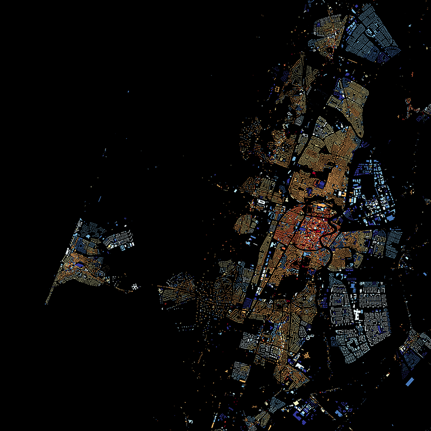

# Buildings in the Netherlands by year of construction

View map on http://code.waag.org/buildings.

Map showing all 9,866,539 <a href="http://www.kadaster.nl/web/file?uuid=25da4675-fc9c-47a6-8039-1af04c142965&owner=23cbe925-35ce-4a72-ac8c-a33a0c19ae1e&contentid=2585">buildings</a> in the Netherlands, shaded according to year of construction. Data from <a href="http://www.kadaster.nl/bag">BAG</a>, via <a href="http://citysdk.waag.org/">CitySDK</a>. Map made with <a href="http://www.mapbox.com/tilemill/">TileMill</a> by <a href="mailto:bert@waag.org">Bert Spaan</a>, <a href="http://waag.org/">Waag Society</a>, inspired by <a href="http://bklynr.com/block-by-block-brooklyns-past-and-present/">BKLYNR</a>.

[](http://code.waag.org/buildings)

# License

<a rel="license" href="http://creativecommons.org/licenses/by-nc-sa/4.0/"></a><br />This work is licensed under a <a rel="license" href="http://creativecommons.org/licenses/by-nc-sa/4.0/">Creative Commons Attribution-NonCommercial-ShareAlike 4.0 International License</a>.

# Make a similar map yourself

The map is made with open data and open source software only. This section of the README explains how to get the data, create the map and [export](../../tree/gh-pages/sections) high-res PNG and PDF files.

## Download and import BAG data

Install PostgreSQL and PostGIS, download data from [NLExtract](http://nlextract.nl/) and import into database `bag`. Details can be found in [NLExtract's documentation](https://nlextract.readthedocs.org/en/latest/bagextract.html).

## Create buildings table

To create a map with buildings by year of construction (or area and function), execute the following SQL:

```sql
-- Aggregate mode function, to compute modal area and function
-- From: http://wiki.postgresql.org/wiki/Aggregate_Mode
CREATE OR REPLACE FUNCTION _final_mode(anyarray)
  RETURNS anyelement AS
$BODY$
    SELECT a
    FROM unnest($1) a
    GROUP BY 1
    ORDER BY COUNT(1) DESC, 1
    LIMIT 1;
$BODY$
LANGUAGE 'sql' IMMUTABLE;

CREATE AGGREGATE mode(anyelement) (
  SFUNC=array_append, --Function to call for each row. Just builds the array
  STYPE=anyarray,
  FINALFUNC=_final_mode, --Function to call after everything has been added to array
  INITCOND='{}' --Initialize an empty array when starting
);

CREATE SCHEMA tilemill;

CREATE TABLE tilemill.buildings AS
SELECT
  p.identificatie::bigint, bouwjaar::int,
  ST_Transform(p.geovlak, 4326) AS geom,
  round(mode(oppervlakteverblijfsobject)) AS oppervlakte,
  mode(vg.gebruiksdoelverblijfsobject::text) AS gebruiksdoel
FROM verblijfsobjectactueelbestaand v
JOIN verblijfsobjectpandactueel vp
  ON vp.identificatie = v.identificatie
JOIN pandactueelbestaand p
  ON vp.gerelateerdpand = p.identificatie
JOIN verblijfsobjectgebruiksdoelactueel vg
  ON v.identificatie = vg.identificatie
GROUP BY
  p.identificatie, bouwjaar, p.geovlak;

CREATE INDEX buildings_geom_idx
  ON tilemill.buildings
  USING gist (geom);
```

## Create TileMill project and map tiles

Install [TileMill](https://www.mapbox.com/tilemill/), copy the contents of the `tilemill` to your local TileMill projects directory (usually `~/Documents/MapBox/project`), or create a symbolic link. The TileMill project file connects with PostgreSQL using user `postgres` and password `postgres`. Edit `project.mml` to change user and password.

A script to export high-res images is available in the [`sections`](../../tree/gh-pages/sections) directory of this repository.
